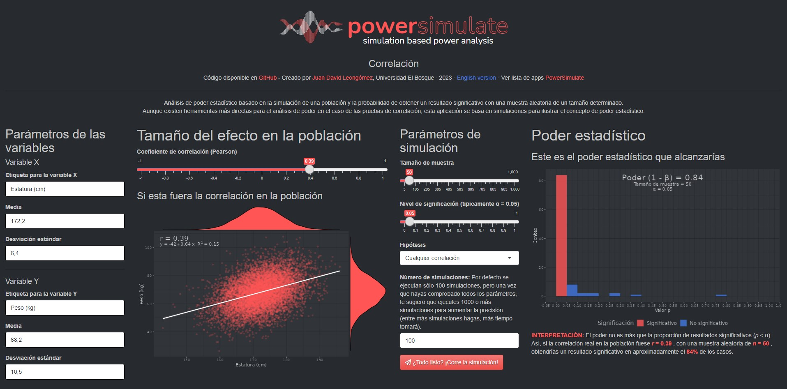

[PowerSimulate](https://shiny.jdl-svr.lat/PowerSimulate/) is a collection of compact R Shiny applications designed to perform simulation-based statistical power analysis. 

Although there are more straightforward tools for power analysis in simple tests such as correlations, t-tests and ANOVA, these applications are based exclusively on simulations. They serve as an educational tool to demonstrate the concept of statistical power, but also as a platform to show the importance of simulation-based power analysis for more complex designs.

<figure>
    
    <figcaption>Example interface of a PowerSimulate application.</figcaption>
</figure>

Below you will see the index of available applications [PowerSimulate](https://shiny.jdl-svr.lat/PowerSimulate/). To open an application, simply go to the English section and click on the corresponding link. Please note that English and Spanish versions of each application are available. 

<html>
<head><title>Shiny App Iframe</title></head>
<body>
<iframe id="PowerSimulate" src="https://shiny.jdl-svr.lat/PowerSimulate" style="border: none; width: 100%; height: 1650px" frameborder="0"></iframe>
</body>
</html>

All applications are available on my (rather slow) [Shiny personal server](https://shiny.jdl-svr.lat/PowerSimulate/). However, if it runs too slow or my server doesn't work, you can always run it locally on your computer with R installed. Just open the link to the code on GitHub, and you'll find instructions there.
